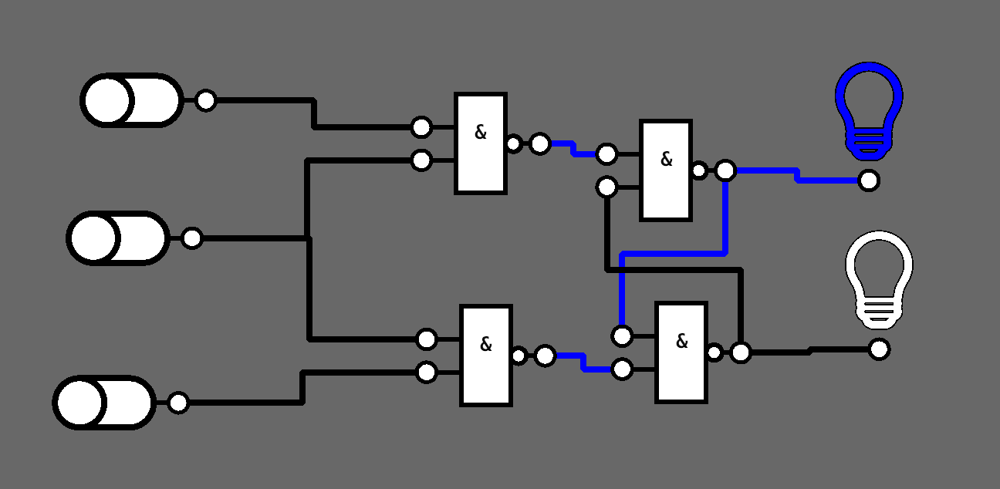

# Nodus

A graphical __logic gate simulator__.

> __Disclaimer:__ This piece of software is in an very early stage of development
> and far from complete.

## Features

* Create nodes (gates, input controls, output controls) and connect them to
  build simple circuits.
* Radial Context Menu

## Credits

* [The Bevy Engine](https://bevyengine.org/)
* [Bevy Prototype Lyon](https://github.com/Nilirad/bevy_prototype_lyon)
