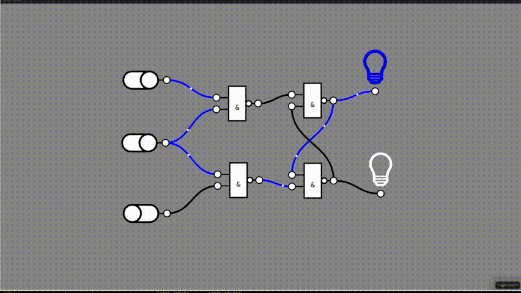

# Nodus

A graphical __logic gate simulator__.

> __Disclaimer:__ This software is in active development. 

## Controls

- `lmb pressed`: select/ drag
- `rmb pressed`: open context menu
- `mouse wheele`: zoom
- `mouse wheele pressed`: pan

## Features

* Create nodes (gates, input controls, output controls) and connect them to
  build simple circuits.
* Radial Context Menu

## Planned Features

- [ ] Create new logic components from existing circuits
- [ ] Save and Load circuits
- [ ] Group select components
- [ ] More input controls (e.g. button, clock)
- [ ] More output controls (e.g. 7 segment display)
- [ ] Create truth tables from circuits

## Credits

* [The Bevy Engine](https://bevyengine.org/)
* [Bevy Prototype Lyon](https://github.com/Nilirad/bevy_prototype_lyon)
