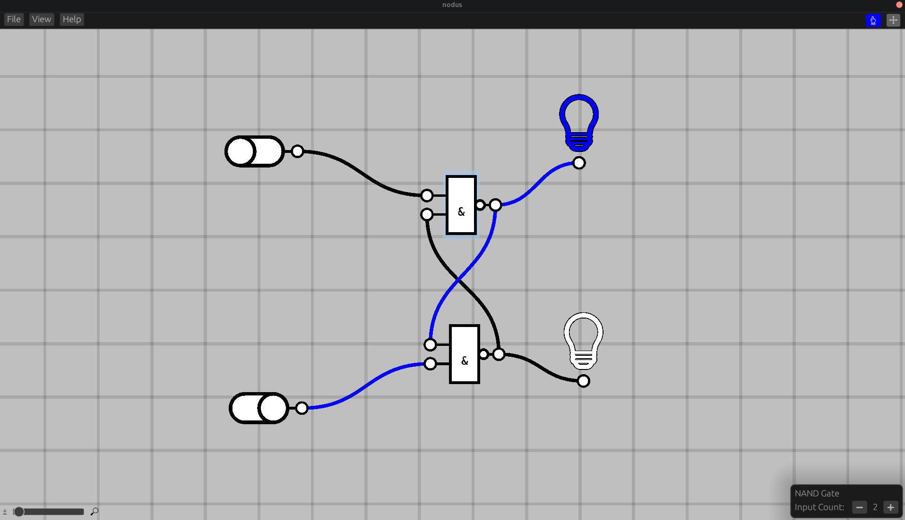
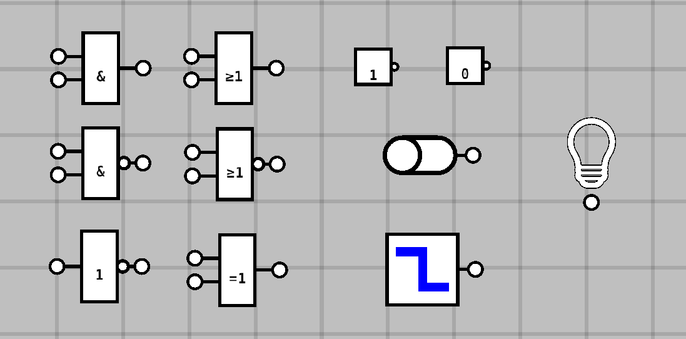
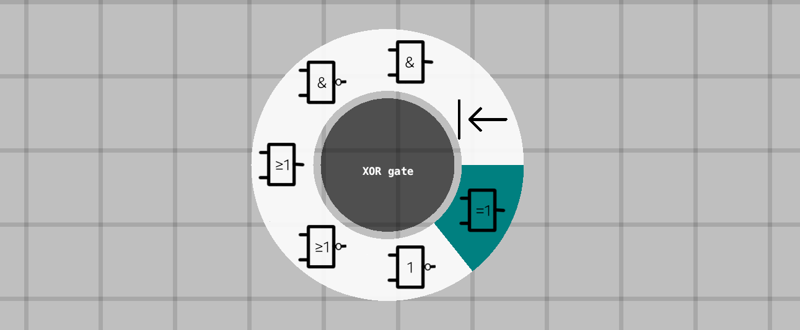
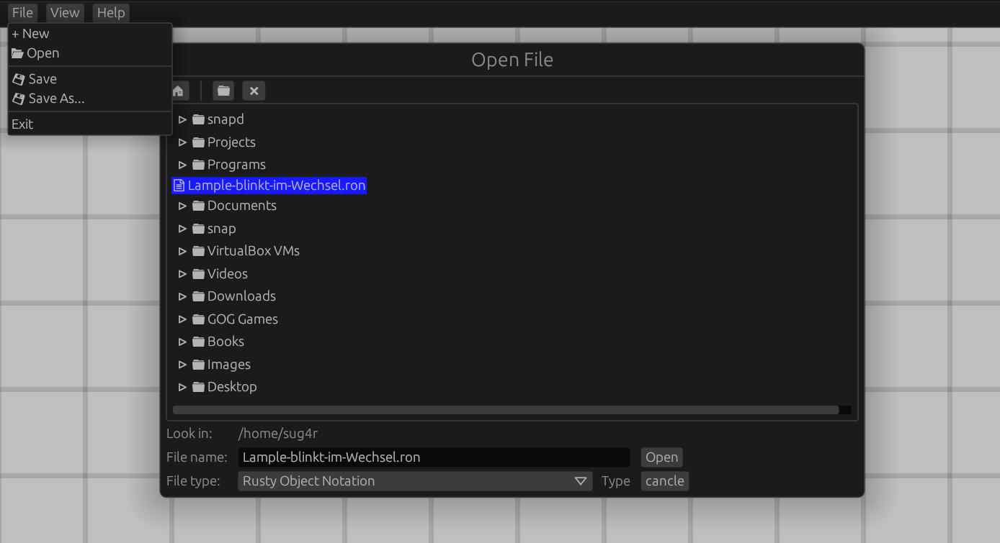

# Nodus

A graphical __logic gate simulator__.

This project is in an early stage of development but most of the basic features are implemented.

## Features

Choose from a variety of logic gates, input controls and output controls to build digital circuits using
a drag and drop interface.

| Gates | Input controls | Output controls |
|:-----:|:--------------:|:---------------:|
|  AND  |   High const   |   Light bulb    |
| NAND |   Low const    |                 |
| OR | Toggle switch  |                 |
| NOR |     Clock      |                 |
| NOT |                |                 |
| XOR |                |                 |

Insert components into the world using a radial context menu.

Save the circuits you've created in a [.ron](https://github.com/ron-rs/ron) file and reload them later.

## Controls

- `lmb pressed`: select/ drag (selection mode - `s`), pan (pan mode - `p`)
- `rmb pressed`: open context menu
- `mouse wheel`: zoom

## Planned Features

- [ ] Create new logic components from existing circuits
- [ ] More output controls (e.g. 7 segment display)
- [ ] Create truth tables from circuits

## Credits

* [The Bevy Engine](https://bevyengine.org/)
* [Bevy Prototype Lyon](https://github.com/Nilirad/bevy_prototype_lyon)
